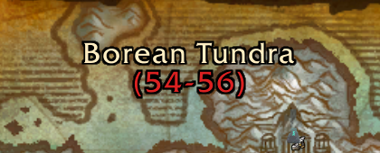

# ZonesLevel-TriumVirate

A lightweight 3.3.5a addon that displays the mouse hovered zone's level range under its title on the world map.

This is a fork of [ZonesLevel-Epoch](https://github.com/Arthur-Helias/ZonesLevel-Epoch) by Walter Bennet, backported to the TriumVirate server by Jedborg.

## Screenshot

## Installation

1. Download the [latest version](https://github.com/JedborgWoW/ZonesLevel-TriumVirate/archive/refs/heads/master.zip) of the addon.
2. Extract the archive.
3. Rename the folder from "ZonesLevel-TriumVirate-master" to "ZonesLevel-TriumVirate".
4. Copy the renamed folder into `WoW-Directory\Interface\AddOns`.
5. Enable the addon from the addons menu on the character selection screen.

## Compatibility

This addon was designed for the TriumVirate server. It should be compatible with any 3.3.5 client; zones whose in-game name does not match an entry in the table simply show no range.
This addon should be compatible with any addon that does not also try to modify the zone's name at the top of your map.

## Credits

[Jedborg](https://github.com/JedborgWoW) - Backport to the TriumVirate server

[Walter Bennet](https://github.com/Arthur-Helias) - Original addon (ZonesLevel-Epoch)

[Tenyar97](https://github.com/Tenyar97) - Turtle WoW version of LevelRange, inspiration
